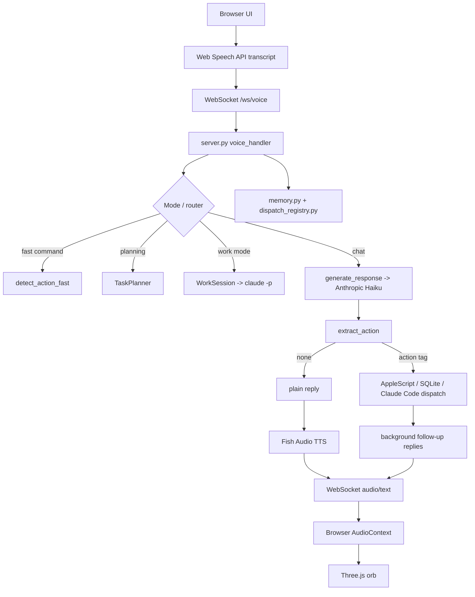

## 1. Executive Summary

The current Jarvis repo is a macOS voice assistant centered on a single backend file, `server.py`, plus a browser frontend built with Vite, TypeScript, and Three.js. It does real work today: voice conversation, task tracking, Apple Calendar/Mail/Notes access, screen awareness, Claude Code project dispatch, and a distinctive reactive UI.

What it does well is fast iteration. The repo keeps many useful ideas in one place: SQLite memory, conversational planning, action tags, dispatch tracking, and proactive background responses. What must change for a Windows-native, zero-cost, local-first future is the foundation: remove browser speech dependence, replace AppleScript and paid APIs, split orchestration from adapters, and move to a native Python desktop shell with local STT, local LLM, native tray support, and explicit Windows integrations.

I reviewed commit `ff59800576f67f80eeea309a03899abb4767b696` from [ethanplusai/jarvis](https://github.com/ethanplusai/jarvis).

## 2. Current Repository Architecture

Top level, the repo is split between a Python backend, a browser UI, and a set of macOS adapters. In practice, almost all runtime authority lives in `C:\Users\anshu\Downloads\Codex\jarvis_upstream\server.py`. The frontend is mostly a voice transport and orb renderer. Several other modules look partially integrated or drifted. That is inferred from missing runtime references and mismatched tests.

Backend architecture:
- FastAPI app in `server.py`
- WebSocket endpoint for voice loop
- Anthropic for reasoning
- Fish Audio for TTS
- SQLite memory and dispatch tracking
- Claude Code subprocess dispatch for build/research/project work
- AppleScript bridges for Calendar, Mail, Notes, screen, Terminal, Chrome, Finder

Frontend architecture:
- Vite + TypeScript app in `frontend/`
- Web Speech API in browser for STT
- WebSocket client for text/audio/status messages
- Three.js particle orb for visual state
- Settings drawer that posts API keys and preferences to backend endpoints

Voice/input/output pipeline:
- Browser mic -> Web Speech API transcript -> WebSocket JSON -> `voice_handler`
- Backend replies via Anthropic and optional action tags
- Fish Audio returns MP3 bytes
- Backend base64-encodes most audio responses and sends them back
- Browser decodes MP3 via `AudioContext` and drives orb animation

Action execution pipeline:
- Fast keyword router in `detect_action_fast`
- Planning flow via `TaskPlanner`
- Work mode via `WorkSession` and `claude -p`
- LLM action tags parsed by `extract_action`
- Actions executed through AppleScript helpers or Claude Code subprocesses

Memory/state handling:
- `memory.py` stores memories, tasks, and notes in `data/jarvis.db`
- `dispatch_registry.py` stores recent and active project dispatches in the same DB
- `tracking.py`, `learning.py`, `evolution.py`, and `ab_testing.py` use a different DB, `jarvis_data.db`
- `server.py` also keeps in-memory conversation history, rolling summary, active lookups, and task state

System integrations:
- Apple Calendar, Mail, Notes via AppleScript
- Screen/window enumeration via AppleScript and `screencapture`
- Terminal, Chrome, Finder via AppleScript
- Optional Swift desktop overlay via `desktop-overlay/JarvisOverlay.swift`

How the assistant decides what to do:
- Short obvious commands first go through `detect_action_fast`
- If planning is active, `TaskPlanner` owns the next turn
- If work mode is active, most requests go to `claude -p`
- Otherwise `generate_response` sends the conversation and huge system prompt to Anthropic Haiku
- The LLM may append `[ACTION:...]` tags, which are parsed and dispatched

| File/Module | Responsibility | Inputs | Outputs | Risks/Issues |
|---|---|---|---|---|
| `README.md` | Product description and setup | User setup steps | Mental model of system | Docs present the happy path, not the actual complexity or security surface |
| `server.py` | FastAPI app, WebSocket loop, LLM prompt construction, TTS, dispatching, settings API, restart logic | WebSocket transcripts, REST calls, cached context | Spoken replies, actions, task state | Monolith, mixed concerns, unauthenticated control endpoints, drifted logic |
| `actions.py` | AppleScript actions for Terminal, Chrome, Claude Code sessions | Parsed actions | Immediate system side effects | macOS-only, tightly coupled to Terminal/Chrome naming |
| `memory.py` | SQLite memories, tasks, notes, memory extraction | User text, assistant text | Context snippets, persisted records | Mixed memory/task/note concerns, no abstraction boundary |
| `planner.py` | Planning classifier, question flow, prompt assembly | User requests, project list | Clarifying questions, final prompt | Anthropic-dependent planning, partially overlaps `conversation.py` |
| `work_mode.py` | Persistent `claude -p` project sessions | Project dir, user prompt | Claude Code output | Hard dependency on Claude CLI, 300s blocking subprocess path |
| `calendar_access.py` / `mail_access.py` / `notes_access.py` | Native data access | Apple apps + AppleScript | Structured events, mail, notes | Entirely macOS-bound |
| `screen.py` | Window enumeration, screenshots, vision summary | System Events, `screencapture`, Anthropic vision | Screen summary | macOS-bound and paid-model dependent |
| `frontend/src/main.ts`, `voice.ts`, `ws.ts` | Browser state machine, Web Speech, playback, WebSocket | Mic input, WebSocket payloads | Transcript messages, audio playback | Chrome/Web Speech dependency, browser autoplay friction |
| `frontend/src/orb.ts` / `style.css` | Particle orb and styling | Audio analyser, app state | Visual animation | Heavy visual focus, minimal productivity UI |
| `frontend/src/settings.ts` | Key entry and preference UI | User settings input | Backend POSTs | Writes sensitive config through unauthenticated local API |
| `desktop-overlay/JarvisOverlay.swift` | macOS desktop orb overlay | WebSocket status | Transparent orb on desktop | Separate platform-specific client, not portable |
| `tests/*.py` | Planner, browser, QA, feedback-loop tests | Module APIs | Test assertions | Drifted from runtime, for example `ACTION_KEYWORDS` no longer exists |

## 3. Core Logic Deconstruction

Bullet flow:
- Startup loads `.env`, sets constants, creates FastAPI app, optionally creates Anthropic client, and starts a background context thread.
- Frontend boot loads the orb, opens `/ws/voice`, starts browser speech recognition, and resumes audio on user interaction.
- Each final browser transcript is sent as `{"type":"transcript","text":...}`.
- `voice_handler` normalizes STT errors, updates session history, and branches into planning mode, work mode, fast actions, or general chat.
- Fast actions handle screen, calendar, mail, task list, terminal, recent build status, and a few fixed phrases without an LLM call.
- General chat calls `generate_response`, which builds a large system prompt from current time, weather, cached screen/calendar/mail state, dispatch state, known Desktop projects, memory context, conversation history, and session summary.
- The Anthropic response is scanned for `[ACTION:...]` tags.
- Action tags trigger background AppleScript operations, SQLite updates, or Claude Code dispatches through `_execute_prompt_project` / `WorkSession`.
- Spoken replies go through Fish Audio TTS, then back to the frontend over WebSocket.
- Background lookups and project dispatches can later interrupt the conversation with follow-up audio.



Voice transcription and playback:
- Transcription is browser-side only. The backend never receives raw audio.
- Playback is browser-side only. The backend sends MP3 payloads and status messages.
- Inferred issue: `_lookup_and_report` and one `fix_self` path send raw audio bytes instead of base64, while the main path base64-encodes them. That inconsistency is in `server.py` and is likely a real bug.

## 4. Feature Set Inventory

Conversation:
- Voice chat via browser STT/TTS loop: Replace. The concept stays, but Chrome Web Speech plus Fish Audio plus browser playback is the wrong platform stack for Windows local-first.
- Typed interaction via hidden console/logging: Refactor. Keep typed input, make it first-class in the native desktop app.
- JARVIS persona and short spoken replies: Keep. The tone is part of the product identity, but the prompt should be shorter and less brittle.

Productivity:
- Calendar summary: Refactor. Keep the user value, replace Apple Calendar adapter with Windows/local integrations.
- Mail read-only summaries: Refactor. Keep read-only safety, replace Apple Mail bridge.
- Notes and task capture: Keep. These fit local-first well and should stay in SQLite with optional Markdown files.

Automation:
- Claude Code build dispatch: Replace. The repo treats Claude Code as a core runtime dependency; in the redesign it should be an optional integration, not the backbone.
- Research mode: Replace. Current path assumes paid models and browser automation; redesign around local model summarization with optional browser/tool plugins.
- Background proactive follow-ups: Refactor. Keep the behavior, rebuild it on a native event bus and explicit job model.

Developer tooling:
- QA auto-retry loop: Remove from core for now. Good idea, but the runtime is drifted and references undefined objects.
- A/B prompt testing and template evolution: Remove from the main app. These are experiment-lab concerns, not desktop assistant core.
- Project planner and prompt templates: Refactor. Keep the idea for advanced modes, but not as a hardwired cloud-first flow.

Memory/context:
- SQLite memories, tasks, notes: Keep. This is one of the better design choices in the repo.
- Automatic memory extraction by Anthropic: Replace. Use explicit local memory capture first, optional model-assisted extraction later.
- Dispatch registry: Refactor. Keep build/job history, but move it into a general local job store.

UI/visualization:
- Three.js orb: Replace. The aesthetic can survive, but a Windows desktop assistant needs a native console UI, status badges, tray controls, and real logs.
- Settings panel: Refactor. Keep configuration UI, but bind it to local settings objects, not `.env` rewrite endpoints over open HTTP.
- Swift desktop overlay: Remove. It is macOS-only and separate from the main app.

System integration:
- AppleScript actions: Remove. They are the main portability blocker.
- Screen awareness and active-window context: Refactor. Keep the capability, rebuild with Windows-native APIs.
- Finder/Terminal/Chrome assumptions: Replace. Use Explorer, PowerShell, app launch helpers, notifications, and tray actions.

## 5. Optimization and Modernization Opportunities

| Category | Problem | Why it matters | Recommended fix | Refactor priority |
|---|---|---|---|---|
| Architecture | `server.py` owns transport, prompting, memory injection, action dispatch, settings, restart, and TTS | Hard to test, reason about, or port | Split into orchestrator, providers, memory, actions, config, UI adapters | High |
| Architecture | Multiple parallel control paths: fast actions, planning, work mode, task manager, action tags | Behavior is inconsistent and hard to debug | Use one orchestrator with explicit command pipeline and job model | High |
| Maintainability | Dead or drifted modules such as `browser.py`, `conversation.py`, `learning.py`, `evolution.py`, `ab_testing.py` | Codebase intent is unclear | Remove unused paths or move them behind feature flags and interfaces | High |
| Reliability | `_run_qa` references `qa_agent` and `success_tracker`, but they are not defined in runtime imports | Completed tasks can fail at runtime | Restore missing imports or remove QA loop from runtime until wired correctly | High |
| Testability | `tests/test_browser_integration.py` imports `ACTION_KEYWORDS`, which no longer exists | Test suite no longer reflects reality | Rebuild tests around active entrypoints and contracts | High |
| Portability | AppleScript, `osascript`, `open -a`, `screencapture`, Cocoa overlay, Chrome STT | Repo is effectively macOS-only | Replace with Windows-native adapters and local STT | High |
| Security/privacy | FastAPI binds to `0.0.0.0`, allows `*` CORS, exposes settings write and restart endpoints without auth | Any reachable client on the local network could modify config or restart the app | Default to loopback, remove open CORS, require local desktop UI for config, avoid writable control endpoints | High |
| Security/privacy | Paid cloud dependencies are hard requirements: Anthropic, Fish Audio, Claude Code | Not zero-cost, not local-first | Make Ollama/llama.cpp and local Whisper the default path | High |
| Performance | Browser + Vite + WebSocket + Fish Audio + Three.js is a heavy stack for a desktop assistant | More memory, more moving parts, browser autoplay quirks | Move to native PySide6 UI and direct local service calls | Medium |
| Performance | Background context thread shells out to AppleScript every 30s and hardcodes weather for St. Petersburg, FL | Wasteful, wrong for most users | Use on-demand Windows sensors/integrations and local caching | Medium |
| Reliability | Settings are read into module globals at import time, so updating keys/preferences often needs restart | UI lies about live state | Use a runtime settings object with change notifications | Medium |
| Data design | Memory/dispatch use `data/jarvis.db`, while tracking/evolution use `jarvis_data.db` | Data ownership is fragmented | Consolidate to one SQLite DB with clear tables and repository classes | Medium |
| UX | Main UI is mostly an orb with tiny controls and no rich transcript surface | Weak for desktop productivity | Use a command log, subsystem badges, tray menu, quick actions, and explicit degraded-state messaging | High |
| Extensibility | No provider or plugin interface for LLM/STT/TTS/actions | Every new capability edits core files | Introduce base provider interfaces and an action registry | High |

## 6. Windows-First Redesign

The redesigned app should be a native Python desktop process with a thin but real UI, a local model provider, local STT, explicit Windows actions, and a single orchestrator. The app should boot even when Ollama or Whisper is unavailable, show degraded subsystem status, and keep local data in SQLite under `%LOCALAPPDATA%`.

Layered modules:
- `ui/`: PySide6 main window, terminal log, badges, tray, scanline overlay
- `core/`: event bus, app state, orchestrator
- `providers/`: local model providers, later optional fallback providers
- `voice/`: recording, transcription, optional TTS
- `memory/`: SQLite store, preferences, lightweight retrieval
- `actions/`: safe Windows actions and command dispatch
- `integrations/`: clipboard, screenshots, shell, startup registration, active window detection
- `services/`: notifications, hotkeys, background jobs
- `config/`: settings loading/saving and runtime configuration
- `tests/`: smoke tests, provider mocks, action safety tests

Recommended file tree:

```text
jarvis_windows_app/
├── app.py
├── requirements.txt
├── README.md
├── config/
│   └── settings.py
├── core/
│   ├── app_state.py
│   ├── event_bus.py
│   └── orchestrator.py
├── providers/
│   └── llm/
│       ├── base.py
│       └── ollama_provider.py
├── voice/
│   └── stt_whisper.py
├── memory/
│   └── store.py
├── actions/
│   └── system_actions.py
├── ui/
│   ├── main_window.py
│   ├── system_tray.py
│   └── widgets/
│       ├── console_log.py
│       ├── command_input.py
│       ├── status_badges.py
│       └── scanline_overlay.py
├── integrations/
│   ├── clipboard.py
│   ├── screenshots.py
│   ├── startup.py
│   └── windows_context.py
├── services/
│   ├── hotkeys.py
│   ├── notifications.py
│   └── jobs.py
└── tests/
    ├── test_actions.py
    ├── test_memory.py
    └── test_orchestrator.py
```

## 7. Improved Windows Feature Set

| Feature | User value | Implementation approach | Privacy/security considerations |
|---|---|---|---|
| File search/open helpers | Fast access to documents and projects | `pathlib`, indexed search, Explorer open actions | Keep searches local, avoid remote indexing |
| File move/copy helpers | Lightweight desktop automation | Safe action wrappers with path validation | Confirm destructive operations, log actions locally |
| App launching | Quick workflow jumps | `os.startfile`, Start Menu lookup, known app aliases | Restrict to local launch, no hidden elevation |
| Safe PowerShell execution | Real desktop power without shell chaos | Allow read-oriented commands, block destructive verbs | Default deny for destructive patterns, timeouts, output truncation |
| Clipboard awareness | Better conversational context | Win32 clipboard or Qt clipboard adapter | Never persist clipboard unless user asks |
| Screenshot capture | Local visual context | Windows Graphics Capture or PIL/ImageGrab fallback | Store in temp only, explicit user control |
| Active window awareness | Smarter context handoff | `pywin32`/UI Automation | Read metadata only, no keylogging |
| Notifications | Background completion signals | Native Windows toast notifications | Local-only notifications, no telemetry |
| Startup-on-login | Real assistant behavior | Startup folder shortcut or registry helper | User opt-in only |
| Tray quick actions | Background usability | `QSystemTrayIcon` actions: show, voice, health, quit | Local process only |
| Offline note-taking | Fast memory capture | SQLite plus optional Markdown export | Local-only by default |
| Local memory/preferences | Persistence without cloud | SQLite + JSON settings in `%LOCALAPPDATA%` | No secrets in UI code or remote endpoints |
| Model health indicators | Honest degraded mode | Ping Ollama and Whisper loaders | Expose status only, no secret handling |
| Push-to-talk hotkey | Faster voice interaction | Windows hotkey registration | User opt-in, foreground-safe behavior |
| Optional local TTS | Fully offline voice loop | Piper or Windows SAPI adapter | Keep local voice output local |

## 8. Recommended Technical Stack

| Area | Choice | Why |
|---|---|---|
| UI framework | PySide6 | Native-feeling Windows desktop UI, tray support, good styling, solid packaging path |
| Local model runtime | Ollama by default, llama.cpp optional fallback | Ollama is the easiest local runtime to install; llama.cpp is the portable fallback for tighter control |
| STT | faster-whisper + sounddevice | Good local accuracy, practical Python integration, CPU-friendly with `tiny.en` or `base.en` |
| Optional TTS | Piper | Fully local, lightweight, no paid dependency |
| Local database | SQLite with WAL | Simple, fast, zero-admin, enough for memory/jobs/preferences |
| Task orchestration | Qt main thread plus background asyncio worker thread | Keeps UI responsive without dragging a browser into the stack |
| System tray | Qt `QSystemTrayIcon` | Native and already in the chosen UI stack |
| Windows integration helpers | Standard library first, `pywin32`/`psutil` as needed | Keeps the starter lean, expands only where Windows APIs help |
| Packaging/distribution | PyInstaller one-folder build | Easiest path for shipping PySide6 plus local assets and model tooling on Windows |

## 9. Boilerplate Implementation

I generated a functional starter at `C:\Users\anshu\Downloads\Codex\jarvis_windows_app`.

What it includes:
- Native PySide6 main window with amber-on-black terminal styling
- Command log, command input, voice button, health badges, scanline overlay
- Tray icon with hide/show and quit
- Local Ollama provider with graceful degraded mode
- Local faster-whisper STT with lazy model loading
- SQLite conversation and memory store
- Safe local action layer for opening files/URLs and running read-oriented PowerShell commands
- Background orchestrator thread so the UI stays responsive

What it intentionally does not hardwire yet:
- Paid APIs
- Frontend secrets
- Browser speech or browser UI
- macOS-only integrations
- Local TTS, screenshot capture, active-window introspection, and startup registration in the starter path; those are the next module additions

Verification:
- `python -m compileall .` succeeded in `C:\Users\anshu\Downloads\Codex\jarvis_windows_app`

**Filename: `jarvis_windows_app/app.py`**
```python
from __future__ import annotations

import ctypes
import logging
import sys

from PySide6.QtCore import QTimer
from PySide6.QtWidgets import QApplication

from actions.system_actions import SystemActions
from config.settings import AppSettings
from core.app_state import AppState
from core.event_bus import EventBus
from core.orchestrator import Orchestrator
from memory.store import MemoryStore
from providers.llm.ollama_provider import OllamaProvider
from ui.main_window import MainWindow
from ui.system_tray import SystemTrayController
from voice.stt_whisper import WhisperSTT


def configure_logging(log_file) -> None:
    logging.basicConfig(
        level=logging.INFO,
        format="%(asctime)s [%(levelname)s] %(name)s: %(message)s",
        handlers=[
            logging.FileHandler(log_file, encoding="utf-8"),
            logging.StreamHandler(sys.stdout),
        ],
    )


def set_windows_app_id(app_id: str) -> None:
    if not sys.platform.startswith("win"):
        return
    try:
        ctypes.windll.shell32.SetCurrentProcessExplicitAppUserModelID(app_id)
    except Exception:
        pass


def main() -> int:
    settings = AppSettings.load()
    configure_logging(settings.log_file)
    set_windows_app_id(settings.app_id)

    app = QApplication(sys.argv)
    app.setApplicationName(settings.app_name)
    app.setQuitOnLastWindowClosed(False)

    bus = EventBus()
    state = AppState(max_logs=settings.max_console_blocks)
    memory = MemoryStore(settings.database_path)
    llm = OllamaProvider(settings)
    voice = WhisperSTT(settings)
    actions = SystemActions()
    orchestrator = Orchestrator(settings, state, bus, memory, llm, voice, actions)

    window = MainWindow(settings)
    tray = SystemTrayController(app, window)
    window.set_hide_to_tray(tray.is_available())

    bus.subscribe("log", window.append_log)
    bus.subscribe("status", window.update_statuses)

    window.command_input.submitted.connect(orchestrator.submit_text)
    window.command_input.voice_requested.connect(orchestrator.submit_voice_capture)

    dispatch_timer = QTimer()
    dispatch_timer.timeout.connect(lambda: bus.dispatch_pending())
    dispatch_timer.start(30)

    health_timer = QTimer()
    health_timer.timeout.connect(orchestrator.refresh_health)
    health_timer.start(10000)

    window.update_statuses(state.snapshot_statuses())
    window.show()
    orchestrator.start()

    exit_code = app.exec()
    orchestrator.shutdown()
    return exit_code


if __name__ == "__main__":
    raise SystemExit(main())
```

**Filename: `jarvis_windows_app/requirements.txt`**
```text
PySide6>=6.8
httpx>=0.27
faster-whisper>=1.1
sounddevice>=0.5
numpy>=1.26
```

**Filename: `jarvis_windows_app/README.md`**
```md
# JARVIS Windows Local

Windows-first, local-first AI desktop assistant boilerplate built with Python and PySide6.

## What this starter includes

- Native desktop UI with a retro terminal look
- Qt system tray icon with hide, show, and quit actions
- Local LLM integration through Ollama
- Local speech-to-text through faster-whisper
- Local SQLite conversation and memory store
- Safe Windows action helpers for opening files, URLs, and read-oriented PowerShell commands

## Quick start

1. Install Python 3.11 or newer.
2. Install dependencies:

```powershell
pip install -r requirements.txt
```

3. Install and start Ollama, then pull a compact local model:

```powershell
ollama pull qwen2.5:3b
```

4. Run the app:

```powershell
python app.py
```

## Notes

- Voice transcription uses `tiny.en` by default for lower RAM and CPU load.
- Ollama is the default model runtime. If it is offline, the app stays up and shows degraded status instead of crashing.
- Settings and local data live under `%LOCALAPPDATA%\\JarvisWindowsLocal`.

## Built-in console commands

- `/help`
- `/open <url-or-path>`
- `/ps <safe read-oriented PowerShell command>`
- `/remember <note>`
- `/health`
```

**Filename: `jarvis_windows_app/config/settings.py`**
```python
from __future__ import annotations

import json
import os
from dataclasses import dataclass, field
from pathlib import Path


def _default_app_dir() -> Path:
    local_app_data = os.getenv("LOCALAPPDATA")
    base = Path(local_app_data) if local_app_data else Path.home() / ".jarvis_windows_local"
    return base / "JarvisWindowsLocal"


@dataclass
class AppSettings:
    app_name: str = "JARVIS Local"
    app_id: str = "ethanplusai.jarvis.local.windows"
    window_title: str = "JARVIS // LOCAL CONSOLE"
    theme_accent: str = "#ffb000"
    theme_background: str = "#050505"
    ollama_base_url: str = "http://127.0.0.1:11434"
    ollama_model: str = "qwen2.5:3b"
    ollama_timeout_seconds: float = 45.0
    ollama_num_ctx: int = 4096
    ollama_num_predict: int = 320
    whisper_model_size: str = "tiny.en"
    whisper_device: str = "cpu"
    whisper_compute_type: str = "int8"
    voice_record_seconds: int = 4
    voice_sample_rate: int = 16000
    memory_history_limit: int = 12
    max_console_blocks: int = 800
    app_dir: Path = field(default_factory=_default_app_dir)

    def ensure_directories(self) -> None:
        self.app_dir.mkdir(parents=True, exist_ok=True)

    @property
    def config_file(self) -> Path:
        return self.app_dir / "settings.json"

    @property
    def database_path(self) -> Path:
        return self.app_dir / "jarvis_local.db"

    @property
    def log_file(self) -> Path:
        return self.app_dir / "jarvis.log"

    @property
    def system_prompt(self) -> str:
        return (
            "You are JARVIS, a Windows-first local desktop assistant running entirely on the user's machine. "
            "Keep answers direct, concise, and useful. Use Windows terminology. "
            "Prefer short paragraphs over bullet spam. "
            "If a task depends on an unavailable local subsystem, say what is offline and what the user can do next. "
            "Do not invent files, apps, or command output."
        )

    def to_json_dict(self) -> dict:
        return {
            "app_name": self.app_name,
            "app_id": self.app_id,
            "window_title": self.window_title,
            "theme_accent": self.theme_accent,
            "theme_background": self.theme_background,
            "ollama_base_url": self.ollama_base_url,
            "ollama_model": self.ollama_model,
            "ollama_timeout_seconds": self.ollama_timeout_seconds,
            "ollama_num_ctx": self.ollama_num_ctx,
            "ollama_num_predict": self.ollama_num_predict,
            "whisper_model_size": self.whisper_model_size,
            "whisper_device": self.whisper_device,
            "whisper_compute_type": self.whisper_compute_type,
            "voice_record_seconds": self.voice_record_seconds,
            "voice_sample_rate": self.voice_sample_rate,
            "memory_history_limit": self.memory_history_limit,
            "max_console_blocks": self.max_console_blocks,
        }

    def save(self) -> None:
        self.ensure_directories()
        self.config_file.write_text(json.dumps(self.to_json_dict(), indent=2), encoding="utf-8")

    @classmethod
    def load(cls) -> "AppSettings":
        settings = cls()
        settings.ensure_directories()

        if settings.config_file.exists():
            try:
                raw = json.loads(settings.config_file.read_text(encoding="utf-8"))
                for key, value in raw.items():
                    if hasattr(settings, key):
                        setattr(settings, key, value)
            except json.JSONDecodeError:
                pass

        env_overrides = {
            "JARVIS_OLLAMA_BASE_URL": "ollama_base_url",
            "JARVIS_OLLAMA_MODEL": "ollama_model",
            "JARVIS_WHISPER_MODEL": "whisper_model_size",
            "JARVIS_VOICE_SECONDS": "voice_record_seconds",
        }
        for env_name, attr_name in env_overrides.items():
            value = os.getenv(env_name)
            if not value:
                continue
            current = getattr(settings, attr_name)
            if isinstance(current, int):
                setattr(settings, attr_name, int(value))
            elif isinstance(current, float):
                setattr(settings, attr_name, float(value))
            else:
                setattr(settings, attr_name, value)

        settings.save()
        return settings
```

**Filename: `jarvis_windows_app/core/app_state.py`**
```python
from __future__ import annotations

from collections import deque
from dataclasses import dataclass, field
from datetime import datetime
import threading


@dataclass(slots=True)
class SubsystemStatus:
    name: str
    state: str = "unknown"
    detail: str = "booting"
    updated_at: datetime = field(default_factory=datetime.now)

    def to_dict(self) -> dict:
        return {
            "name": self.name,
            "state": self.state,
            "detail": self.detail,
            "updated_at": self.updated_at.strftime("%H:%M:%S"),
        }


@dataclass(slots=True)
class LogEntry:
    role: str
    text: str
    timestamp: datetime = field(default_factory=datetime.now)

    def to_dict(self) -> dict:
        return {
            "role": self.role,
            "text": self.text,
            "timestamp": self.timestamp.strftime("%H:%M:%S"),
        }


class AppState:
    def __init__(self, max_logs: int = 500) -> None:
        self._lock = threading.RLock()
        self._logs: deque[LogEntry] = deque(maxlen=max_logs)
        self._statuses = {
            "llm": SubsystemStatus(name="llm", detail="waiting for health check"),
            "voice": SubsystemStatus(name="voice", detail="waiting for health check"),
            "memory": SubsystemStatus(name="memory", detail="waiting for health check"),
            "actions": SubsystemStatus(name="actions", detail="waiting for health check"),
        }

    def add_log(self, role: str, text: str) -> LogEntry:
        entry = LogEntry(role=role, text=text)
        with self._lock:
            self._logs.append(entry)
        return entry

    def set_status(self, name: str, state: str, detail: str) -> None:
        with self._lock:
            status = self._statuses.get(name, SubsystemStatus(name=name))
            status.state = state
            status.detail = detail
            status.updated_at = datetime.now()
            self._statuses[name] = status

    def snapshot_statuses(self) -> dict[str, dict]:
        with self._lock:
            return {name: status.to_dict() for name, status in self._statuses.items()}

    def recent_logs(self) -> list[dict]:
        with self._lock:
            return [entry.to_dict() for entry in self._logs]
```

**Filename: `jarvis_windows_app/core/event_bus.py`**
```python
from __future__ import annotations

import queue
import threading
import time
from collections import defaultdict
from dataclasses import dataclass, field
from typing import Any, Callable


@dataclass(slots=True)
class Event:
    name: str
    payload: Any
    created_at: float = field(default_factory=time.time)


class EventBus:
    def __init__(self) -> None:
        self._queue: queue.Queue[Event] = queue.Queue()
        self._subscribers: dict[str, list[Callable[[Any], None]]] = defaultdict(list)
        self._lock = threading.RLock()

    def subscribe(self, event_name: str, callback: Callable[[Any], None]) -> None:
        with self._lock:
            self._subscribers[event_name].append(callback)

    def publish(self, event_name: str, payload: Any) -> None:
        self._queue.put(Event(name=event_name, payload=payload))

    def dispatch_pending(self, limit: int = 128) -> int:
        processed = 0
        while processed < limit:
            try:
                event = self._queue.get_nowait()
            except queue.Empty:
                break

            with self._lock:
                callbacks = list(self._subscribers.get(event.name, []))
                callbacks.extend(self._subscribers.get("*", []))

            for callback in callbacks:
                callback(event.payload)
            processed += 1

        return processed
```

**Filename: `jarvis_windows_app/core/orchestrator.py`**
```python
from __future__ import annotations

import asyncio
import logging
import threading

from actions.system_actions import SystemActions
from config.settings import AppSettings
from core.app_state import AppState
from core.event_bus import EventBus
from memory.store import MemoryStore
from providers.llm.base import ChatMessage
from providers.llm.ollama_provider import OllamaProvider
from voice.stt_whisper import WhisperSTT


log = logging.getLogger(__name__)


class Orchestrator:
    def __init__(
        self,
        settings: AppSettings,
        state: AppState,
        bus: EventBus,
        memory: MemoryStore,
        llm: OllamaProvider,
        voice: WhisperSTT,
        actions: SystemActions,
    ) -> None:
        self.settings = settings
        self.state = state
        self.bus = bus
        self.memory = memory
        self.llm = llm
        self.voice = voice
        self.actions = actions

        self._loop = asyncio.new_event_loop()
        self._thread = threading.Thread(target=self._run_loop, daemon=True, name="jarvis-orchestrator")
        self._running = False

    def start(self) -> None:
        if self._running:
            return
        self._running = True
        self._thread.start()
        self._publish_log("system", "Boot sequence complete. Local-first subsystems are coming online.")
        self.refresh_health()

    def shutdown(self) -> None:
        if not self._running:
            return

        future = asyncio.run_coroutine_threadsafe(self._shutdown_async(), self._loop)
        try:
            future.result(timeout=5)
        except Exception:
            pass

        self._loop.call_soon_threadsafe(self._loop.stop)
        self._thread.join(timeout=2)
        self._running = False

    def submit_text(self, text: str) -> None:
        cleaned = text.strip()
        if not cleaned or not self._running:
            return
        asyncio.run_coroutine_threadsafe(self._handle_text(cleaned, source="typed"), self._loop)

    def submit_voice_capture(self) -> None:
        if not self._running:
            return
        asyncio.run_coroutine_threadsafe(self._capture_voice_input(), self._loop)

    def refresh_health(self) -> None:
        if not self._running:
            return
        asyncio.run_coroutine_threadsafe(self._refresh_health(), self._loop)

    def _run_loop(self) -> None:
        asyncio.set_event_loop(self._loop)
        self._loop.run_forever()

    async def _shutdown_async(self) -> None:
        await self.llm.close()

    async def _capture_voice_input(self) -> None:
        self.state.set_status("voice", "busy", f"recording {self.settings.voice_record_seconds}s clip")
        self._publish_status()
        self._publish_log("system", f"Recording voice input for {self.settings.voice_record_seconds} seconds.")

        try:
            transcript = await self.voice.transcribe_once()
        except Exception as exc:
            self.state.set_status("voice", "error", str(exc))
            self._publish_status()
            self._publish_log("system", f"Voice capture failed: {exc}")
            return

        if not transcript:
            self.state.set_status("voice", "warn", "no speech detected")
            self._publish_status()
            self._publish_log("system", "No speech was detected in the recorded clip.")
            return

        self.state.set_status("voice", "ok", "transcription complete")
        self._publish_status()
        await self._handle_text(transcript, source="voice")

    async def _handle_text(self, text: str, source: str) -> None:
        prefix = "[voice] " if source == "voice" else ""
        self.memory.append_message("user", text, source)
        self._publish_log("user", f"{prefix}{text}")

        try:
            response = await self._dispatch(text)
        except Exception as exc:
            log.exception("Request handling failed")
            response = f"Subsystem error: {exc}"

        self.memory.append_message("assistant", response, "assistant")
        self._publish_log("assistant", response)

    async def _dispatch(self, text: str) -> str:
        if text.startswith("/"):
            return await self._handle_local_command(text)
        return await self._generate_llm_response(text)

    async def _handle_local_command(self, text: str) -> str:
        command, _, args = text.partition(" ")
        args = args.strip()

        if command == "/help":
            return (
                "Commands: /help, /open <url-or-path>, /ps <safe PowerShell>, "
                "/remember <note>, /health."
            )

        if command == "/open":
            result = await self.actions.open_target(args)
            return result.message

        if command == "/ps":
            result = await self.actions.run_powershell_safe(args)
            if result.output:
                return f"{result.message}\n{result.output}"
            return result.message

        if command == "/remember":
            if not args:
                return "Nothing to store."
            self.memory.remember(args)
            return "Stored in local memory."

        if command == "/health":
            await self._refresh_health()
            statuses = self.state.snapshot_statuses()
            return " | ".join(
                f"{name.upper()}={payload['state']} ({payload['detail']})"
                for name, payload in statuses.items()
            )

        return "Unknown command. Use /help for the local command set."

    async def _generate_llm_response(self, text: str) -> str:
        relevant_memory = self.memory.search_memory(text, limit=3)
        system_prompt = self.settings.system_prompt
        if relevant_memory:
            system_prompt += "\nUseful local memory:\n" + "\n".join(f"- {item}" for item in relevant_memory)

        history = [
            ChatMessage(role=item["role"], content=item["content"])
            for item in self.memory.recent_messages(limit=self.settings.memory_history_limit)
        ]

        self.state.set_status("llm", "busy", f"querying {self.settings.ollama_model}")
        self._publish_status()

        try:
            result = await self.llm.chat(history, system_prompt)
            self.state.set_status("llm", "ok", f"responded with {result.model}")
            self._publish_status()
            return result.text.strip()
        except Exception as exc:
            self.state.set_status("llm", "error", str(exc))
            self._publish_status()
            return (
                "Ollama is unavailable. Start Ollama and make sure "
                f"{self.settings.ollama_model} is installed. Local commands still work."
            )

    async def _refresh_health(self) -> None:
        llm_health = await self.llm.healthcheck()
        voice_health = await self.voice.healthcheck()
        memory_health = self.memory.healthcheck()
        action_health = self.actions.healthcheck()

        self.state.set_status("llm", llm_health.state, llm_health.detail)
        self.state.set_status("voice", voice_health["state"], voice_health["detail"])
        self.state.set_status("memory", memory_health["state"], memory_health["detail"])
        self.state.set_status("actions", action_health["state"], action_health["detail"])
        self._publish_status()

    def _publish_log(self, role: str, text: str) -> None:
        payload = self.state.add_log(role, text).to_dict()
        self.bus.publish("log", payload)

    def _publish_status(self) -> None:
        self.bus.publish("status", self.state.snapshot_statuses())
```

**Filename: `jarvis_windows_app/providers/llm/base.py`**
```python
from __future__ import annotations

from abc import ABC, abstractmethod
from dataclasses import dataclass, field
from typing import Any


@dataclass(slots=True)
class ChatMessage:
    role: str
    content: str


@dataclass(slots=True)
class ProviderHealth:
    state: str
    detail: str


@dataclass(slots=True)
class ChatResult:
    text: str
    model: str
    raw: dict[str, Any] = field(default_factory=dict)


class LLMProvider(ABC):
    @abstractmethod
    async def healthcheck(self) -> ProviderHealth:
        raise NotImplementedError

    @abstractmethod
    async def chat(self, messages: list[ChatMessage], system_prompt: str) -> ChatResult:
        raise NotImplementedError

    async def close(self) -> None:
        return None
```

**Filename: `jarvis_windows_app/providers/llm/ollama_provider.py`**
```python
from __future__ import annotations

import logging

import httpx

from config.settings import AppSettings
from providers.llm.base import ChatMessage, ChatResult, LLMProvider, ProviderHealth


log = logging.getLogger(__name__)


class OllamaProvider(LLMProvider):
    def __init__(self, settings: AppSettings) -> None:
        self.settings = settings
        self._client = httpx.AsyncClient(
            base_url=self.settings.ollama_base_url.rstrip("/"),
            timeout=self.settings.ollama_timeout_seconds,
        )

    async def healthcheck(self) -> ProviderHealth:
        try:
            response = await self._client.get("/api/tags")
            response.raise_for_status()
            data = response.json()
            model_names = [model.get("name", "") for model in data.get("models", [])]

            if not model_names:
                return ProviderHealth(
                    state="warn",
                    detail="Ollama is online but no local models are installed",
                )

            if not any(name == self.settings.ollama_model for name in model_names):
                return ProviderHealth(
                    state="warn",
                    detail=f"Ollama is online; missing model {self.settings.ollama_model}",
                )

            return ProviderHealth(
                state="ok",
                detail=f"online using {self.settings.ollama_model}",
            )
        except Exception as exc:
            log.debug("Ollama health check failed: %s", exc)
            return ProviderHealth(
                state="error",
                detail="offline or unreachable on 127.0.0.1:11434",
            )

    async def chat(self, messages: list[ChatMessage], system_prompt: str) -> ChatResult:
        payload_messages = [{"role": "system", "content": system_prompt}]
        payload_messages.extend({"role": msg.role, "content": msg.content} for msg in messages)

        try:
            response = await self._client.post(
                "/api/chat",
                json={
                    "model": self.settings.ollama_model,
                    "messages": payload_messages,
                    "stream": False,
                    "keep_alive": "5m",
                    "options": {
                        "temperature": 0.2,
                        "num_ctx": self.settings.ollama_num_ctx,
                        "num_predict": self.settings.ollama_num_predict,
                    },
                },
            )
            response.raise_for_status()
            data = response.json()
            content = data.get("message", {}).get("content", "").strip()
            if not content:
                raise RuntimeError("Ollama returned an empty response")
            return ChatResult(text=content, model=self.settings.ollama_model, raw=data)
        except Exception as exc:
            raise RuntimeError(
                f"Ollama request failed. Start Ollama and ensure {self.settings.ollama_model} is installed."
            ) from exc

    async def close(self) -> None:
        await self._client.aclose()
```

**Filename: `jarvis_windows_app/voice/stt_whisper.py`**
```python
from __future__ import annotations

import asyncio
import logging
import threading

from config.settings import AppSettings


log = logging.getLogger(__name__)


class WhisperSTT:
    def __init__(self, settings: AppSettings) -> None:
        self.settings = settings
        self._model = None
        self._lock = threading.Lock()
        self._dependency_error: Exception | None = None

        try:
            import numpy as np  # noqa: F401
            import sounddevice as sd  # noqa: F401
            from faster_whisper import WhisperModel  # noqa: F401
        except Exception as exc:
            self._dependency_error = exc

    async def healthcheck(self) -> dict:
        if self._dependency_error:
            return {
                "state": "error",
                "detail": f"faster-whisper stack unavailable: {self._dependency_error}",
            }

        if self._model is None:
            return {
                "state": "ok",
                "detail": f"ready; lazy load {self.settings.whisper_model_size}",
            }

        return {
            "state": "ok",
            "detail": f"loaded {self.settings.whisper_model_size}",
        }

    async def transcribe_once(self, seconds: int | None = None) -> str:
        if self._dependency_error:
            raise RuntimeError(f"Voice stack unavailable: {self._dependency_error}")

        duration = seconds or self.settings.voice_record_seconds
        audio = await asyncio.to_thread(self._record_audio, duration)
        return await asyncio.to_thread(self._transcribe_audio, audio)

    def _ensure_model(self):
        if self._model is not None:
            return self._model

        with self._lock:
            if self._model is None:
                from faster_whisper import WhisperModel

                self._model = WhisperModel(
                    self.settings.whisper_model_size,
                    device=self.settings.whisper_device,
                    compute_type=self.settings.whisper_compute_type,
                )
                log.info("Loaded faster-whisper model: %s", self.settings.whisper_model_size)
        return self._model

    def _record_audio(self, duration: int):
        import numpy as np
        import sounddevice as sd

        frames = int(duration * self.settings.voice_sample_rate)
        recording = sd.rec(
            frames,
            samplerate=self.settings.voice_sample_rate,
            channels=1,
            dtype="float32",
        )
        sd.wait()
        return np.squeeze(recording)

    def _transcribe_audio(self, audio) -> str:
        model = self._ensure_model()
        segments, _ = model.transcribe(
            audio,
            language="en",
            beam_size=1,
            vad_filter=True,
        )
        return " ".join(segment.text.strip() for segment in segments).strip()
```

**Filename: `jarvis_windows_app/memory/store.py`**
```python
from __future__ import annotations

import sqlite3
import time
from pathlib import Path


class MemoryStore:
    def __init__(self, db_path: Path) -> None:
        self.db_path = Path(db_path)
        self.db_path.parent.mkdir(parents=True, exist_ok=True)
        self._init_db()

    def _connect(self) -> sqlite3.Connection:
        conn = sqlite3.connect(str(self.db_path))
        conn.row_factory = sqlite3.Row
        conn.execute("PRAGMA journal_mode=WAL")
        return conn

    def _init_db(self) -> None:
        conn = self._connect()
        conn.executescript(
            """
            CREATE TABLE IF NOT EXISTS conversation_log (
                id INTEGER PRIMARY KEY AUTOINCREMENT,
                role TEXT NOT NULL,
                content TEXT NOT NULL,
                source TEXT NOT NULL DEFAULT 'typed',
                created_at REAL NOT NULL
            );

            CREATE TABLE IF NOT EXISTS memory_items (
                id INTEGER PRIMARY KEY AUTOINCREMENT,
                content TEXT NOT NULL,
                created_at REAL NOT NULL
            );
            """
        )
        conn.commit()
        conn.close()

    def append_message(self, role: str, content: str, source: str = "typed") -> None:
        conn = self._connect()
        conn.execute(
            "INSERT INTO conversation_log (role, content, source, created_at) VALUES (?, ?, ?, ?)",
            (role, content, source, time.time()),
        )
        conn.commit()
        conn.close()

    def recent_messages(self, limit: int = 12) -> list[dict]:
        conn = self._connect()
        rows = conn.execute(
            """
            SELECT role, content
            FROM conversation_log
            WHERE role IN ('user', 'assistant')
            ORDER BY id DESC
            LIMIT ?
            """,
            (limit,),
        ).fetchall()
        conn.close()
        return [dict(row) for row in reversed(rows)]

    def remember(self, content: str) -> None:
        conn = self._connect()
        conn.execute(
            "INSERT INTO memory_items (content, created_at) VALUES (?, ?)",
            (content, time.time()),
        )
        conn.commit()
        conn.close()

    def search_memory(self, query: str, limit: int = 3) -> list[str]:
        conn = self._connect()
        rows = conn.execute(
            """
            SELECT content
            FROM memory_items
            WHERE content LIKE ?
            ORDER BY id DESC
            LIMIT ?
            """,
            (f"%{query.strip()}%", limit),
        ).fetchall()
        conn.close()
        return [row["content"] for row in rows]

    def healthcheck(self) -> dict:
        try:
            conn = self._connect()
            conn.execute("SELECT 1").fetchone()
            conn.close()
            return {"state": "ok", "detail": str(self.db_path)}
        except Exception as exc:
            return {"state": "error", "detail": f"SQLite unavailable: {exc}"}
```

**Filename: `jarvis_windows_app/actions/system_actions.py`**
```python
from __future__ import annotations

import asyncio
import os
import platform
import re
import shutil
import webbrowser
from dataclasses import dataclass
from pathlib import Path


@dataclass(slots=True)
class ActionResult:
    success: bool
    message: str
    output: str = ""


class SystemActions:
    _DANGEROUS_PATTERNS = [
        r"\bremove-item\b",
        r"\bdel\b",
        r"\berase\b",
        r"\brmdir\b",
        r"\bformat\b",
        r"\bshutdown\b",
        r"\brestart-computer\b",
        r"\bstop-computer\b",
        r"\bclear-disk\b",
        r"\bset-executionpolicy\b",
        r"\breg\s+delete\b",
    ]

    def healthcheck(self) -> dict:
        shell = shutil.which("powershell") or shutil.which("pwsh")
        if platform.system() != "Windows":
            return {"state": "warn", "detail": "designed for Windows; running in compatibility mode"}
        if not shell:
            return {"state": "warn", "detail": "PowerShell not found"}
        return {"state": "ok", "detail": f"PowerShell ready at {shell}"}

    async def open_target(self, target: str) -> ActionResult:
        return await asyncio.to_thread(self._open_target_sync, target)

    def _open_target_sync(self, target: str) -> ActionResult:
        target = target.strip().strip('"')
        if not target:
            return ActionResult(False, "No target provided.")

        if target.startswith(("http://", "https://")):
            webbrowser.open(target)
            return ActionResult(True, f"Opened {target}.")

        path = Path(target).expanduser()
        if not path.exists():
            return ActionResult(False, f"Path not found: {path}")

        if hasattr(os, "startfile"):
            os.startfile(str(path))
        else:
            webbrowser.open(path.as_uri())
        return ActionResult(True, f"Opened {path}.")

    async def run_powershell_safe(self, command: str, timeout: int = 15) -> ActionResult:
        command = command.strip()
        if not command:
            return ActionResult(False, "No PowerShell command provided.")

        if self._looks_dangerous(command):
            return ActionResult(False, "Blocked potentially destructive PowerShell command.")

        shell = shutil.which("powershell") or shutil.which("pwsh")
        if not shell:
            return ActionResult(False, "PowerShell was not found on this machine.")

        process = await asyncio.create_subprocess_exec(
            shell,
            "-NoProfile",
            "-Command",
            command,
            stdout=asyncio.subprocess.PIPE,
            stderr=asyncio.subprocess.PIPE,
        )
        try:
            stdout, stderr = await asyncio.wait_for(process.communicate(), timeout=timeout)
        except asyncio.TimeoutError:
            process.kill()
            return ActionResult(False, "PowerShell command timed out.")

        output = stdout.decode(errors="ignore").strip()
        error = stderr.decode(errors="ignore").strip()

        if process.returncode != 0:
            return ActionResult(False, error or "PowerShell command failed.", output=output)

        return ActionResult(True, "PowerShell command completed.", output=output[:1200])

    def _looks_dangerous(self, command: str) -> bool:
        lowered = command.lower()
        return any(re.search(pattern, lowered) for pattern in self._DANGEROUS_PATTERNS)
```

**Filename: `jarvis_windows_app/ui/main_window.py`**
```python
from __future__ import annotations

from PySide6.QtCore import Qt
from PySide6.QtGui import QCloseEvent, QFont
from PySide6.QtWidgets import QFrame, QLabel, QMainWindow, QVBoxLayout, QWidget

from config.settings import AppSettings
from ui.widgets.command_input import CommandInputWidget
from ui.widgets.console_log import ConsoleLogWidget
from ui.widgets.scanline_overlay import ScanlineOverlay
from ui.widgets.status_badges import StatusBadgesWidget


class MainWindow(QMainWindow):
    def __init__(self, settings: AppSettings, parent=None) -> None:
        super().__init__(parent)
        self.settings = settings
        self._hide_to_tray = True
        self._allow_close = False

        self.setWindowTitle(self.settings.window_title)
        self.resize(1180, 760)
        self.setMinimumSize(960, 620)

        font = QFont("Cascadia Mono")
        if not font.exactMatch():
            font = QFont("Consolas")
        font.setStyleHint(QFont.StyleHint.Monospace)
        self.setFont(font)

        central = QWidget(self)
        central.setObjectName("mainWindowRoot")
        self.setCentralWidget(central)

        root_layout = QVBoxLayout(central)
        root_layout.setContentsMargins(18, 18, 18, 18)
        root_layout.setSpacing(12)

        header = QFrame(central)
        header.setObjectName("headerFrame")
        header_layout = QVBoxLayout(header)
        header_layout.setContentsMargins(0, 0, 0, 0)
        header_layout.setSpacing(2)

        title = QLabel("JARVIS // WINDOWS NODE", header)
        title.setObjectName("titleLabel")
        subtitle = QLabel("LOCAL-FIRST // OLLAMA // WHISPER // SYSTEM TRAY ONLINE", header)
        subtitle.setObjectName("subtitleLabel")
        header_layout.addWidget(title)
        header_layout.addWidget(subtitle)

        self.status_badges = StatusBadgesWidget(central)
        self.console_log = ConsoleLogWidget(max_blocks=self.settings.max_console_blocks, parent=central)
        self.command_input = CommandInputWidget(central)

        root_layout.addWidget(header)
        root_layout.addWidget(self.status_badges)
        root_layout.addWidget(self.console_log, 1)
        root_layout.addWidget(self.command_input)

        self.scanline_overlay = ScanlineOverlay(central)
        self.scanline_overlay.raise_()

        self._apply_styles()

    def _apply_styles(self) -> None:
        self.setStyleSheet(
            """
            QMainWindow, QWidget#mainWindowRoot {
                background-color: #050505;
                color: #ffc14d;
            }
            QFrame#headerFrame {
                background: transparent;
                border: 1px solid rgba(255, 176, 0, 0.16);
                border-radius: 8px;
                padding: 8px;
            }
            QLabel#titleLabel {
                color: #ffb000;
                font-size: 24px;
                font-weight: 700;
                letter-spacing: 2px;
            }
            QLabel#subtitleLabel {
                color: rgba(255, 193, 77, 0.68);
                font-size: 11px;
                letter-spacing: 2px;
            }
            QFrame#consoleFrame {
                border: 1px solid rgba(255, 176, 0, 0.2);
                border-radius: 8px;
                background-color: rgba(6, 6, 6, 0.92);
            }
            QPlainTextEdit#consoleView {
                background-color: rgba(0, 0, 0, 0.8);
                color: #ffcc70;
                border: none;
                padding: 12px;
                selection-background-color: rgba(255, 176, 0, 0.28);
            }
            QFrame#commandInputFrame {
                border: 1px solid rgba(255, 176, 0, 0.2);
                border-radius: 8px;
                background-color: rgba(10, 10, 10, 0.94);
                padding: 8px;
            }
            QLineEdit#commandLineEdit {
                background-color: rgba(0, 0, 0, 0.88);
                border: 1px solid rgba(255, 176, 0, 0.25);
                color: #ffe1a3;
                padding: 12px;
                border-radius: 6px;
            }
            QPushButton#commandSendButton, QPushButton#commandVoiceButton {
                background-color: rgba(255, 176, 0, 0.08);
                border: 1px solid rgba(255, 176, 0, 0.32);
                color: #ffb000;
                padding: 10px 14px;
                border-radius: 6px;
                min-width: 88px;
            }
            QPushButton#commandSendButton:hover, QPushButton#commandVoiceButton:hover {
                background-color: rgba(255, 176, 0, 0.16);
            }
            QFrame#statusBadgesFrame {
                background: transparent;
            }
            QLabel#statusBadge {
                border-radius: 11px;
                padding: 6px 10px;
                font-size: 11px;
                letter-spacing: 1px;
                border: 1px solid rgba(255, 176, 0, 0.22);
                background-color: rgba(255, 176, 0, 0.05);
                color: #ffcc70;
            }
            QLabel#statusBadge[state="ok"] {
                border: 1px solid rgba(89, 255, 149, 0.3);
                background-color: rgba(89, 255, 149, 0.08);
                color: #8cffb1;
            }
            QLabel#statusBadge[state="warn"] {
                border: 1px solid rgba(255, 184, 77, 0.35);
                background-color: rgba(255, 184, 77, 0.12);
                color: #ffd08c;
            }
            QLabel#statusBadge[state="error"] {
                border: 1px solid rgba(255, 92, 92, 0.35);
                background-color: rgba(255, 92, 92, 0.1);
                color: #ff8d8d;
            }
            QLabel#statusBadge[state="busy"] {
                border: 1px solid rgba(77, 214, 255, 0.35);
                background-color: rgba(77, 214, 255, 0.1);
                color: #88e7ff;
            }
            """
        )

    def set_hide_to_tray(self, enabled: bool) -> None:
        self._hide_to_tray = enabled

    def append_log(self, payload: dict) -> None:
        self.console_log.append_entry(payload)

    def update_statuses(self, payload: dict) -> None:
        self.status_badges.update_badges(payload)

    def prepare_to_quit(self) -> None:
        self._allow_close = True

    def resizeEvent(self, event) -> None:
        super().resizeEvent(event)
        if self.centralWidget() is not None:
            self.scanline_overlay.setGeometry(self.centralWidget().rect())
            self.scanline_overlay.raise_()

    def closeEvent(self, event: QCloseEvent) -> None:
        if self._hide_to_tray and not self._allow_close:
            self.hide()
            event.ignore()
            return
        super().closeEvent(event)
```

**Filename: `jarvis_windows_app/ui/widgets/console_log.py`**
```python
from __future__ import annotations

from PySide6.QtWidgets import QFrame, QPlainTextEdit, QVBoxLayout


class ConsoleLogWidget(QFrame):
    def __init__(self, max_blocks: int = 800, parent=None) -> None:
        super().__init__(parent)
        self.setObjectName("consoleFrame")

        self._view = QPlainTextEdit(self)
        self._view.setReadOnly(True)
        self._view.setMaximumBlockCount(max_blocks)
        self._view.setLineWrapMode(QPlainTextEdit.LineWrapMode.WidgetWidth)
        self._view.setObjectName("consoleView")

        layout = QVBoxLayout(self)
        layout.setContentsMargins(0, 0, 0, 0)
        layout.addWidget(self._view)

    def append_entry(self, payload: dict) -> None:
        timestamp = payload.get("timestamp", "--:--:--")
        role = str(payload.get("role", "system")).upper()[:3]
        text = str(payload.get("text", "")).strip()
        self._view.appendPlainText(f"[{timestamp}] {role} {text}")
        scrollbar = self._view.verticalScrollBar()
        scrollbar.setValue(scrollbar.maximum())
```

**Filename: `jarvis_windows_app/ui/widgets/command_input.py`**
```python
from __future__ import annotations

from PySide6.QtCore import Signal
from PySide6.QtWidgets import QFrame, QHBoxLayout, QLineEdit, QPushButton


class CommandInputWidget(QFrame):
    submitted = Signal(str)
    voice_requested = Signal()

    def __init__(self, parent=None) -> None:
        super().__init__(parent)
        self.setObjectName("commandInputFrame")

        self.line_edit = QLineEdit(self)
        self.line_edit.setObjectName("commandLineEdit")
        self.line_edit.setPlaceholderText("Type a command, ask a question, or use /help")

        self.send_button = QPushButton("SEND", self)
        self.send_button.setObjectName("commandSendButton")

        self.voice_button = QPushButton("VOICE", self)
        self.voice_button.setObjectName("commandVoiceButton")

        layout = QHBoxLayout(self)
        layout.setContentsMargins(0, 0, 0, 0)
        layout.setSpacing(10)
        layout.addWidget(self.line_edit, 1)
        layout.addWidget(self.voice_button)
        layout.addWidget(self.send_button)

        self.line_edit.returnPressed.connect(self._emit_submit)
        self.send_button.clicked.connect(self._emit_submit)
        self.voice_button.clicked.connect(self.voice_requested.emit)

    def _emit_submit(self) -> None:
        text = self.line_edit.text().strip()
        if not text:
            return
        self.submitted.emit(text)
        self.line_edit.clear()
```

**Filename: `jarvis_windows_app/ui/widgets/status_badges.py`**
```python
from __future__ import annotations

from PySide6.QtWidgets import QFrame, QHBoxLayout, QLabel


class StatusBadgesWidget(QFrame):
    def __init__(self, parent=None) -> None:
        super().__init__(parent)
        self.setObjectName("statusBadgesFrame")
        self._labels: dict[str, QLabel] = {}

        layout = QHBoxLayout(self)
        layout.setContentsMargins(0, 0, 0, 0)
        layout.setSpacing(8)

        for key in ("llm", "voice", "memory", "actions"):
            label = QLabel(key.upper(), self)
            label.setObjectName("statusBadge")
            label.setProperty("state", "unknown")
            self._labels[key] = label
            layout.addWidget(label)

        layout.addStretch(1)

    def update_badges(self, statuses: dict[str, dict]) -> None:
        for key, label in self._labels.items():
            payload = statuses.get(key, {})
            state = payload.get("state", "unknown")
            detail = payload.get("detail", "")
            label.setText(f"{key.upper()} {state.upper()}")
            label.setToolTip(detail)
            label.setProperty("state", state)
            label.style().unpolish(label)
            label.style().polish(label)
```

**Filename: `jarvis_windows_app/ui/widgets/scanline_overlay.py`**
```python
from __future__ import annotations

from PySide6.QtCore import QTimer, Qt
from PySide6.QtGui import QColor, QLinearGradient, QPainter
from PySide6.QtWidgets import QWidget


class ScanlineOverlay(QWidget):
    def __init__(self, parent=None) -> None:
        super().__init__(parent)
        self.setAttribute(Qt.WidgetAttribute.WA_TransparentForMouseEvents, True)
        self.setAttribute(Qt.WidgetAttribute.WA_NoSystemBackground, True)
        self.setAttribute(Qt.WidgetAttribute.WA_TranslucentBackground, True)
        self._phase = 0

        self._timer = QTimer(self)
        self._timer.timeout.connect(self._tick)
        self._timer.start(75)

    def _tick(self) -> None:
        self._phase = (self._phase + 3) % max(120, self.height() + 120)
        self.update()

    def paintEvent(self, event) -> None:
        painter = QPainter(self)
        painter.setRenderHint(QPainter.RenderHint.Antialiasing, False)

        for y in range(0, self.height(), 4):
            alpha = 12 if (y // 4) % 2 == 0 else 7
            painter.fillRect(0, y, self.width(), 1, QColor(255, 176, 0, alpha))

        sweep = QLinearGradient(0, self._phase - 120, 0, self._phase)
        sweep.setColorAt(0.0, QColor(255, 176, 0, 0))
        sweep.setColorAt(0.5, QColor(255, 176, 0, 18))
        sweep.setColorAt(1.0, QColor(255, 176, 0, 0))
        painter.fillRect(self.rect(), sweep)
```

**Filename: `jarvis_windows_app/ui/system_tray.py`**
```python
from __future__ import annotations

from PySide6.QtCore import Qt
from PySide6.QtGui import QAction, QColor, QIcon, QPainter, QPixmap, QPen
from PySide6.QtWidgets import QMenu, QSystemTrayIcon


class SystemTrayController:
    def __init__(self, app, window) -> None:
        self.app = app
        self.window = window
        self.tray = QSystemTrayIcon(self._build_icon(), window)
        self.tray.setToolTip("JARVIS Local")

        menu = QMenu()
        self.toggle_action = QAction("Hide", menu)
        self.quit_action = QAction("Quit", menu)

        self.toggle_action.triggered.connect(self.toggle_window)
        self.quit_action.triggered.connect(self.quit_application)

        menu.addAction(self.toggle_action)
        menu.addSeparator()
        menu.addAction(self.quit_action)

        self.tray.setContextMenu(menu)
        self.tray.activated.connect(self._handle_activation)

        if QSystemTrayIcon.isSystemTrayAvailable():
            self.tray.show()

    def is_available(self) -> bool:
        return QSystemTrayIcon.isSystemTrayAvailable()

    def toggle_window(self) -> None:
        if self.window.isVisible():
            self.window.hide()
            self.toggle_action.setText("Show")
            return

        self.window.show()
        self.window.raise_()
        self.window.activateWindow()
        self.toggle_action.setText("Hide")

    def quit_application(self) -> None:
        self.window.prepare_to_quit()
        self.tray.hide()
        self.app.quit()

    def _handle_activation(self, reason) -> None:
        if reason == QSystemTrayIcon.ActivationReason.Trigger:
            self.toggle_window()

    def _build_icon(self) -> QIcon:
        pixmap = QPixmap(64, 64)
        pixmap.fill(Qt.GlobalColor.transparent)

        painter = QPainter(pixmap)
        painter.setRenderHint(QPainter.RenderHint.Antialiasing, True)
        painter.fillRect(pixmap.rect(), QColor(8, 8, 8, 220))

        pen = QPen(QColor("#ffb000"))
        pen.setWidth(3)
        painter.setPen(pen)
        painter.drawRoundedRect(8, 8, 48, 48, 8, 8)
        painter.drawLine(18, 24, 46, 24)
        painter.drawLine(18, 34, 40, 34)
        painter.drawLine(18, 44, 32, 44)
        painter.end()

        return QIcon(pixmap)
```

## 10. Migration Plan from Current Jarvis to New Windows App

1. Phase 1: architecture extraction
Goals: split the current repo into transport, orchestration, providers, memory, and actions.
Tasks: carve `server.py` into interfaces; freeze active behavior with a small contract test suite; delete or quarantine dead code paths.
Risks: hidden coupling inside prompt/action flows; drift between README and runtime.
Success criteria: no business logic remains trapped in the WebSocket handler or raw AppleScript branches.

2. Phase 2: provider abstraction
Goals: remove Anthropic/Fish hard-coding.
Tasks: introduce LLM/STT/TTS provider interfaces; add Ollama provider first; move cloud providers behind optional adapters.
Risks: behavior shifts when prompt budgets and latency change.
Success criteria: the assistant can boot and answer locally with no paid API configured.

3. Phase 3: Windows action layer
Goals: replace AppleScript with Windows-native operations.
Tasks: implement shell, file, clipboard, screenshot, notification, startup, and app/window adapters; add safety checks for PowerShell and file ops.
Risks: overexposing dangerous system actions.
Success criteria: all core desktop actions work on Windows with explicit safety constraints.

4. Phase 4: local model integration
Goals: make the voice and chat loop fully local-first.
Tasks: wire faster-whisper STT, Ollama chat, optional Piper TTS, subsystem health probes, and degraded-mode UX.
Risks: model size and latency tradeoffs on lower-end hardware.
Success criteria: typed chat and push-to-talk both work offline once local models are installed.

5. Phase 5: UI redesign
Goals: replace the browser orb app with a native desktop shell.
Tasks: ship the PySide6 console UI, tray, badges, scanlines, quick actions, and transcript log; preserve the Jarvis feel without the browser dependency.
Risks: overbuilding visuals before action flows stabilize.
Success criteria: users can run the assistant entirely from the native desktop app.

6. Phase 6: packaging and testing
Goals: make the Windows app installable and maintainable.
Tasks: add PyInstaller packaging, smoke tests, action safety tests, provider mocks, and configuration migration tooling.
Risks: bundling Whisper/Qt/runtime dependencies cleanly.
Success criteria: one-folder Windows build starts, hides to tray, and runs basic local chat on a clean machine.

## 11. Final Recommendations

Top 10 modernization priorities:
- Break up `server.py` first.
- Remove browser STT from the core design.
- Replace AppleScript with Windows adapters.
- Make Ollama the default reasoning path.
- Make faster-whisper the default STT path.
- Collapse local state into one SQLite database.
- Remove open network control endpoints for settings/restart.
- Rebuild tests around active runtime contracts.
- Move experimental QA/evolution code out of the desktop core.
- Replace the orb-first UI with a console-first native shell.

Top 5 risks:
- Recreating every Apple integration on Windows will take real adapter work.
- Local model quality varies widely by machine and model size.
- Claude Code-centric workflows do not map cleanly to a zero-cost local assistant.
- Security mistakes in shell/file actions can make the desktop app dangerous.
- Carrying over the current prompt-driven action model without restructuring will recreate the same monolith.

Next implementation steps:
1. Start from the generated `jarvis_windows_app` scaffold and add `integrations/windows_context.py`, `integrations/clipboard.py`, and `services/notifications.py`.
2. Replace the current fast command parsing with an action registry plus typed command objects.
3. Add smoke tests for Ollama unavailable, Whisper unavailable, tray hide/show, and PowerShell safety blocking.
